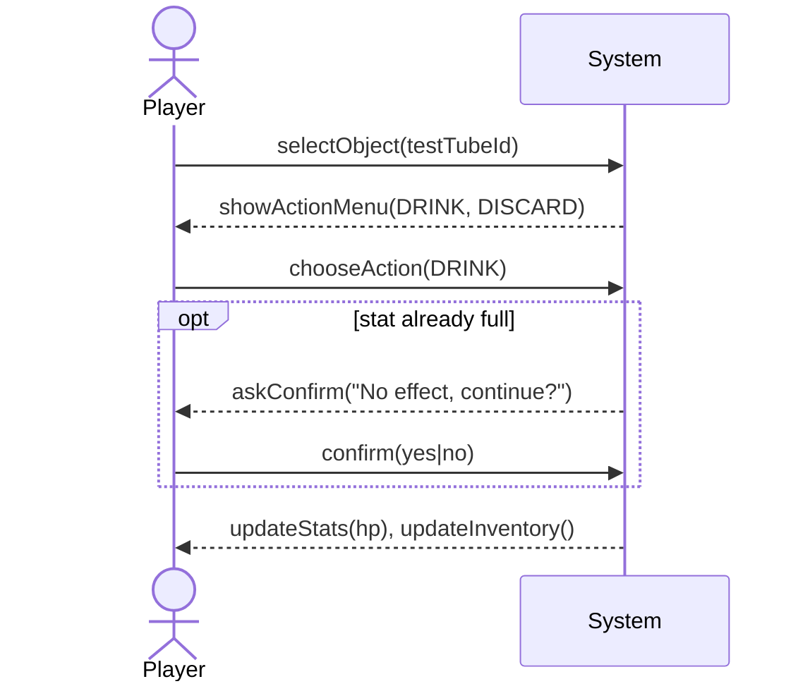
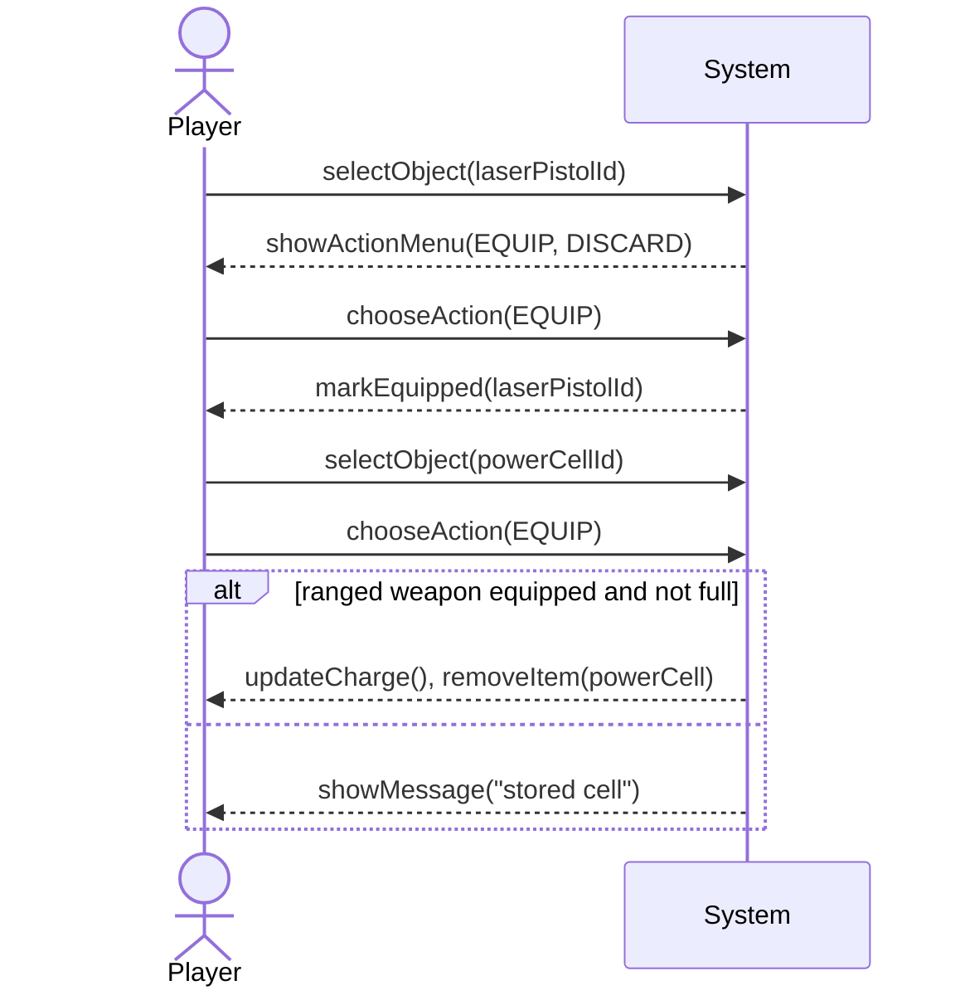
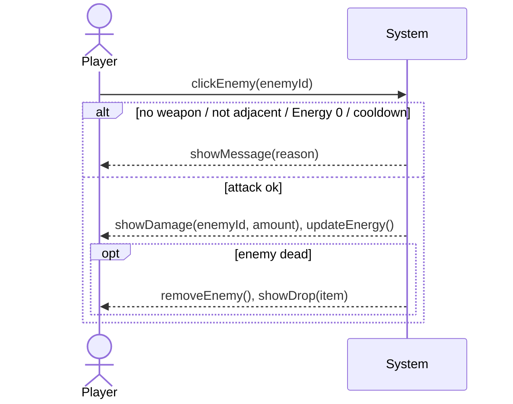
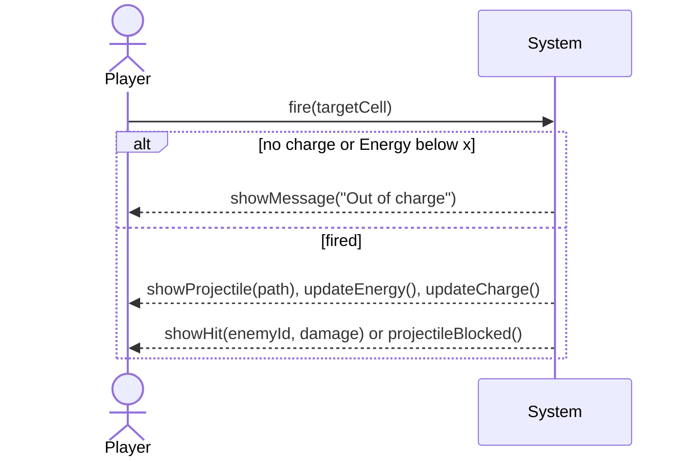

##SSD 9 - Use Case 9

```mermaid
sequenceDiagram
  actor P as Player
  participant S as System
  P->>S: selectObject(testTubeId)
  S-->>P: showActionMenu(DRINK, DISCARD)
  P->>S: chooseAction(DRINK)
  opt stat already full
    S-->>P: askConfirm("No effect, continue?")
    P->>S: confirm(yes|no)
  end
  S-->>P: updateStats(hp), updateInventory()
```

##SSD 10 - Use Case 10

```mermaid
sequenceDiagram
  actor P as Player
  participant S as System
  P->>S: selectObject(laserPistolId)
  S-->>P: showActionMenu(EQUIP, DISCARD)
  P->>S: chooseAction(EQUIP)
  S-->>P: markEquipped(laserPistolId)
  P->>S: selectObject(powerCellId)
  P->>S: chooseAction(EQUIP)
  alt ranged weapon equipped and not full
    S-->>P: updateCharge(), removeItem(powerCell)
  else
    S-->>P: showMessage("stored cell")
  end
```  

##SSD 11 - Use Case 11

```mermaid
sequenceDiagram
  actor P as Player
  participant S as System
  P->>S: clickEnemy(enemyId)
  alt no weapon / not adjacent / Energy 0 / cooldown
    S-->>P: showMessage(reason)
  else attack ok
    S-->>P: showDamage(enemyId, amount), updateEnergy()
    opt enemy dead
      S-->>P: removeEnemy(), showDrop(item)
    end
  end
```

##SSD 12 - Use Case 12

```mermaid
sequenceDiagram
  actor P as Player
  participant S as System
  P->>S: fire(targetCell)
  alt no charge or Energy below x
    S-->>P: showMessage("Out of charge")
  else fired
    S-->>P: showProjectile(path), updateEnergy(), updateCharge()
    S-->>P: showHit(enemyId, damage) or projectileBlocked()
  end
```